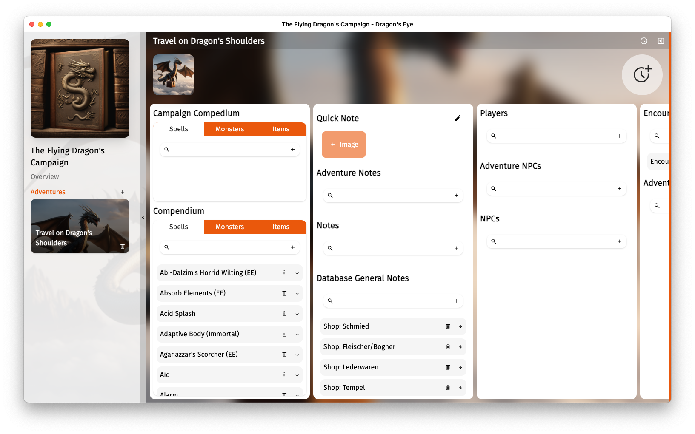
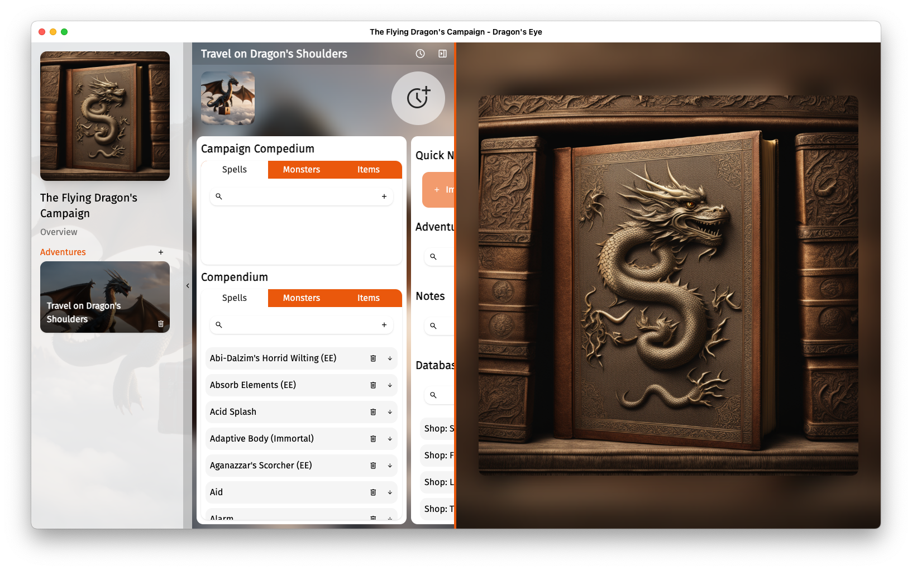
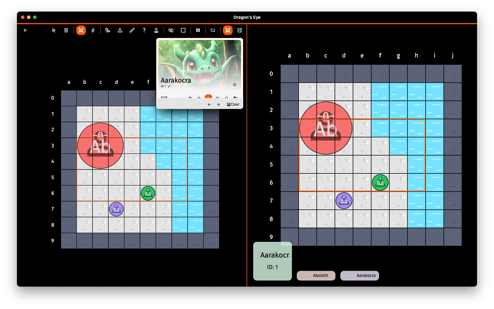

    

# Dragon's Eye
Desktop Campaign Management and VTT Tool. The App is in ongoing development and contains bugs and unfinished features. 

## Features
### Campaign Management

* Build in Compendium for Monsters, Items, Spells, etc.
* Compedium for Campaign Specific Content
* Track NPC and Player Characters
* Time Tracking with Calendar 

    

### Campaign Management with Player View

 * Player View allows to share images and time with players. Works best in combination with OBS.

    

### VTT with Initiative Tracker and Player View

 * Quickly sketch environment for battle encounters (or prepare them forehand)
 * Track Initiative and HP of enemies and npcs

    

## Development & Build 

The App is tested on macOS Sonoma and should run on Windows (and probably Linux) as well.

To develop or extend the App you need to have [Node.js](https://nodejs.org/en/) installed.
Run `npm i` to install necessary packages and `npm run dev` to launch the app in development mode.
